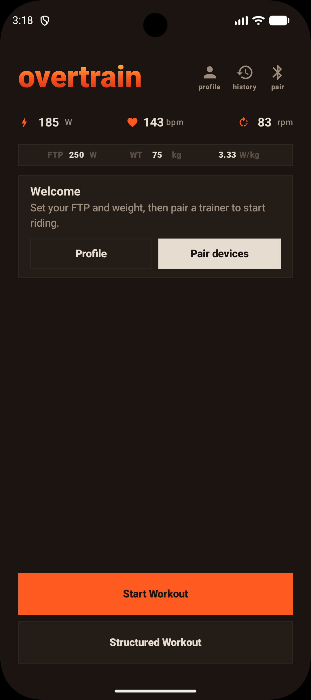
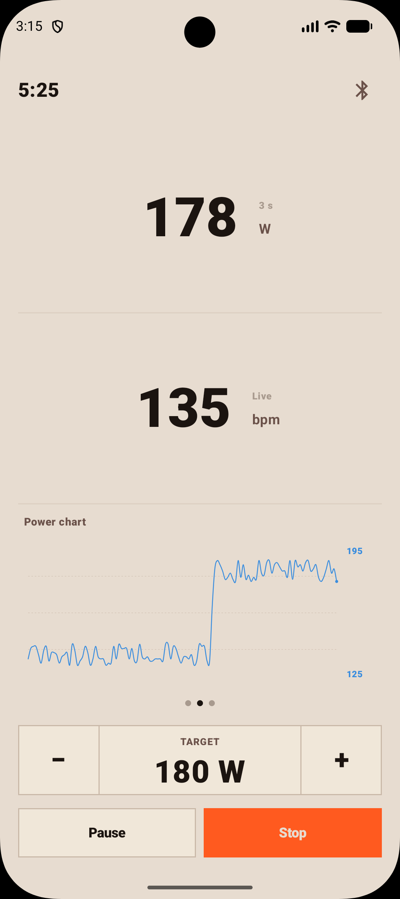
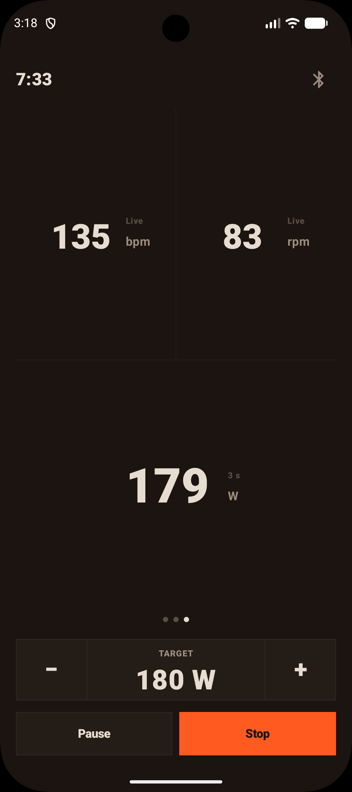

# overtrain

The local-only, customizable cycling training app.

## What is overtrain?

overtrain is an Android app, built for indoor cycling workouts.

The app pairs with modern FTMS smart trainers over Bluetooth, allows cyclists to do their workouts (.zwo format),
and free rides, with pre-built or custom dashboards, and export those workouts as .fit files for
analysis on 3rd party applications (e.g. intervals.icu).

## Who it's for

overtrain is built for cyclists looking for simplicity in their workouts, with full
customization over the data they see while riding. No subscription, no online features,
no gamification.

## What it does

- FTMS smart trainer support (e.g. Tacx, Wahoo), cadence, heart rate monitor support
- ERG, SIM modes for free-ride workouts
- Support for .zwo workouts - small library to choose from, or import your own
- Robust crash and disconnection recovery - workouts survive app kills, reboots, and trainer drop-outs
- Industry-standard .fit files, compatible with major providers
- Customizable workout screens - keep them simple, or build complex multi-screen dashboards

## Requirements

- Android 14+
- FTMS-compatible smart trainer

## Screenshots

  
  
  

## Links

- [Privacy policy](privacy.md)
- [FAQ](faq.md)

## Contact

hi@overtrain.bike
